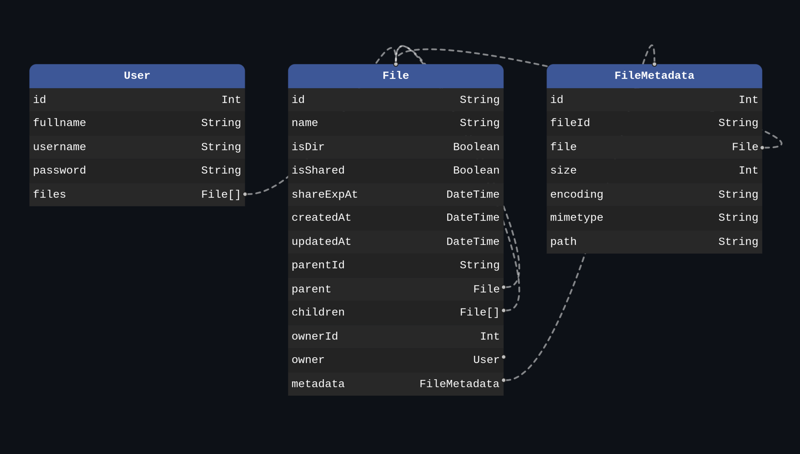

# Odin File Uploader

A stripped-down version of personal storage service like Google Drive. Built as part of studying [**The Odin Project's Node.js course**](https://www.theodinproject.com/paths/full-stack-javascript/courses/nodejs).

> Note: I deliberately minimized the project's UI, so I can focus on practicing the back-end technologies I am studying.

## Prisma Schema Diagram

## Project Requirements

> Note: These requirements were copied from The Odin Project's website at the time of building this project.

1. Set up a new project using Express and Prisma. Install all the necessary dependencies including Passport etc.

2. Set up session based authentication using Passport.js. Use the Prisma session store library to persist sessions in the database.

3. Add a form where authenticated users can upload a file. Save the file in your filesystem for now. You’ll need to integrate the multer middleware. We’ll upload these files once we have all other features working.

4. Add folders. Users should be able to CRUD folders and upload files in them. Set up routes and necessary database interactions for this.

5. Add a route to view specific file details like name, size, and upload time. There should be a download button to allow users to download the file.

6. Finally, add logic to upload files. You could store it in a database, but it’s advised to use a cloud storage service for this use case. You can use Cloudinary or Supabase storage. When a file is uploaded, save the file URL in the database.

### Extra credit

- Add a share folder functionality. When a user wants to share a folder (and all of its contents), they should have a form to specify the duration i.e. 1d, 10d etc. This should generate a link that can be shared with anyone (unauthenticated users). For example, the link could be in the following format: [`https://odin-file-uploader-hussein-kandil.vercel.app/share/70c353d8-8767-4b52-a5a2-389dfb1f7fc8`](https://odin-file-uploader-hussein-kandil.vercel.app/share/70c353d8-8767-4b52-a5a2-389dfb1f7fc8)
